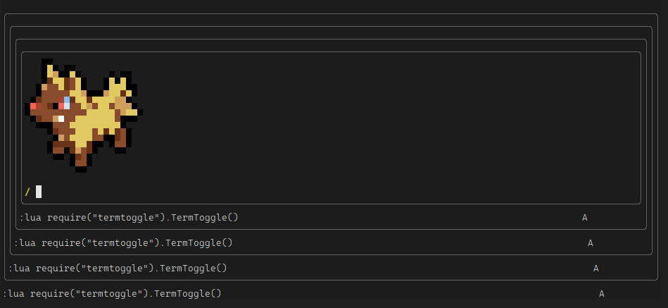

# termToggle.nvim

a simple neovim plugin to toggle terminal window



##### If you need a more feature-rich Plugin [s1n7ax/nvim-terminal](https://github.com/s1n7ax/nvim-terminal) is highly recommended

# Usage

Map the function `lua require('termToggle').TermToggle()` to a key

for e.g

```vim
nnoremap <leader>ct : lua require('termToggle').TermToggle()<CR>
```
